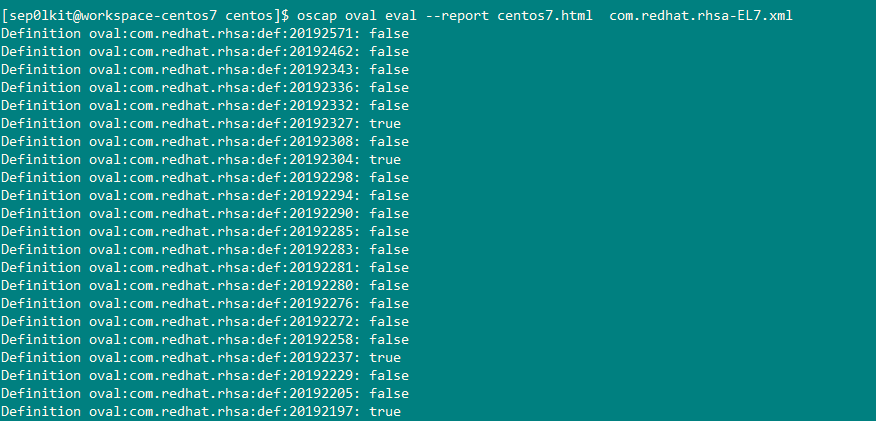
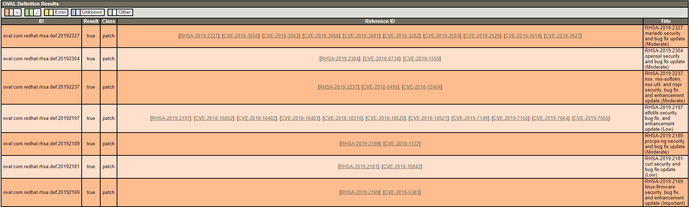
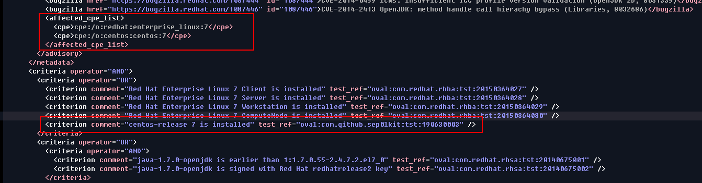
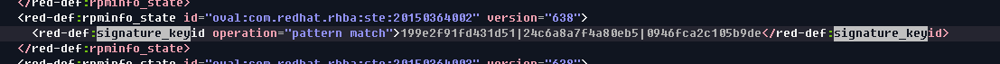

# OVAL-For-EL (Improved oval for enterprise linux)
[中文 (Chinese version)](README.zh-cn.md)    [English (English  version)](README.md)

## Features

- split oval by severity

- convert redhat oval for centos

- add severity and platform on title for debian oval

- automatic update and revise with official security 

- support most enterprise Linux

**Supports**

| OS     | Release       | Upstream                                   | Status  |
| ------ | ------------- | ------------------------------------------ | ------- |
| redhat | RHEL5 - RHEL8 | https://www.redhat.com/security/data/oval/ | syncing |
| centos | EL5 - EL8     | https://www.redhat.com/security/data/oval/ | syncing |
| ubuntu |               |                                            | todo    |
| debian |               |                                            | todo    |


## Files Tree:

```bash
├── centos										
│   ├── com.redhat.rhsa-EL7-Critical.xml        #oval severity is critical
│   ├── com.redhat.rhsa-EL7-Important.xml       #oval severity is important
│   ├── com.redhat.rhsa-EL7-Low.xml             #oval severity is low
│   ├── com.redhat.rhsa-EL7-Moderate.xml        #oval severity is moderate
│   ├── com.redhat.rhsa-EL7.xml                 #all severity oval on centos7
│   ├── ...
└── redhat										
    ├── com.redhat.rhsa-RHEL7-Critical.xml		
    ├── com.redhat.rhsa-RHEL7-Important.xml		
    ├── com.redhat.rhsa-RHEL7-Low.xml			
    ├── com.redhat.rhsa-RHEL7-Moderate.xml		
    ├── com.redhat.rhsa-RHEL7.xml				
    ├── ...
```


## Quick Start

Identify software vulnerabilities on centos 7 with oscap which is a best scap scanner provided by openscap.

- **Download oval-for-el**

  ```
  git clone https://github.com/Sep0lkit/oval-for-el.git
  ```

- **Install oscap**

  ```bash
  sudo yum install openscap openscap-scnner
  ```

- **Run oscap oval**

  - check all vulnerabilities defined for centos7

    ```bash
    oscap oval eval com.redhat.rhsa-EL7.xml
    ```

  - only check one vulnerabilitiy

    Ex: shellchock(CVE-2014-6271). this vulnerabilitiy defined with id oval:com.redhat.rhsa:def:20141293 in com.redhat.rhsa-EL7.xml

    ```bash
    oscap oval eval --id oval:com.redhat.rhsa:def:20141293 com.redhat.rhsa-EL7.xml
    ```

  - export html report with options --report

    ```bash
    oscap oval eval --report centos7.html  com.redhat.rhsa-EL7.xml
    ```

  **Consle output:**

  **HTML report:**
  
  
  
  > Result: true means the vulnerability exists, and the true results always before false in html report

## Details on ovals above

### Redhat:

- split by severity

### CentOS:

 - convert from redhat oval

 - cpe and criterions for centos

   

 - rpm signature key check for centos

   

- split by severity

## Getting Help

